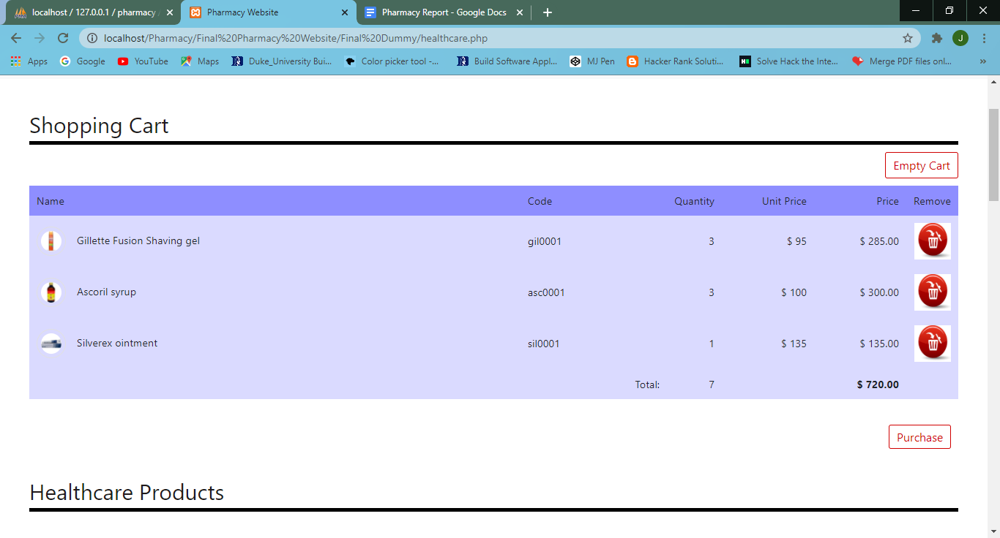

# epharmacy
5th sem Project website development

1)Main Login Page 
User may either Register or they may Login if they are already a member. 

Image 1.a) Sign up Page. Based on user input the given fields are entered incorrectly. 
Using Javascript Validations have been added to the form to check the correctness of user input. 

Image 1.b) Sign up Page. Based on user input the given fields have been entered correctly.
Message prompting Successful Registration. 

Image 1.c)New User data gets added to the database after the given fields were entered
properly. 

Image 1.d) New User can now login with their sign up details. 

2) Home page: 
Image 2.a) once the user enters the correct login details he will be redirected to the
homepage.the page is entirely made of bootstrap , css and html. 

Image 2.b) categories of the healthcare products made using jumbotrons 

Image 2.c) user reviews are made using using carousel which is a bootstrap class. 

3) Medicine page: 
Image 3.a) Shopping cart before the user adds any item to the cart. 

Image 3.b) Product flip card front view. 

Image 3.c) Product flip card back view. Quantity of products can be chosen and added to cart. 

Image 3.d) Shopping cart after the user adds any item to the cart. 

4) Healthcare page: 
Image 4.a) Product cards. 

Image 4.b) Shopping cart after the user adds any item to the cart. 

5) Contact us page: 
Image 5.a) Contact us page wherein users can enter the required details. 

6) Billing page: 
Image 6.a) Users can see their billing details. 

7) Login page: 
Image 7.a) Logging in as an admin. 

8) Admin Home page: 
Image 8.a) Admin Home page. 

9) Admin Medicine page: 
Image 9.a) Admin medicine page to add or delete medicine products. 

Image 9.b) Adding new products details.

Image 9.c) New product details are added to the database.

10) Admin Healthcare page:
Image 10.a) Admin Healthcare page to add or delete healthcare products.

11) Admin Users page:
Image 11.a) Admin created new admin login. 

Image 11.b) New User/Admin details are added to the database.

